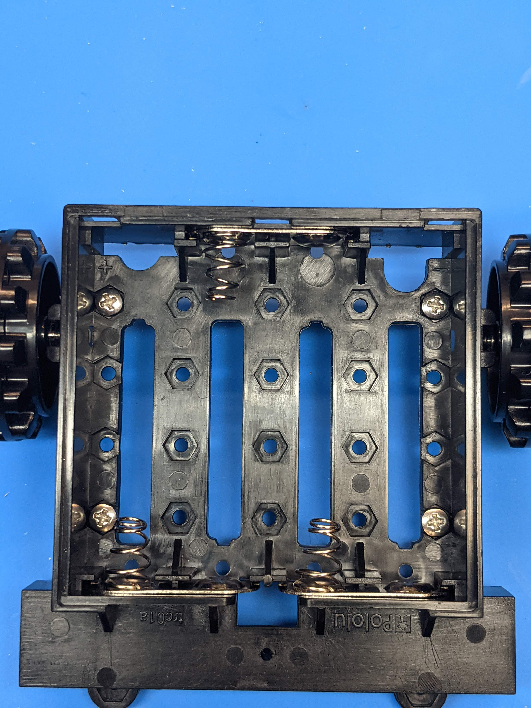
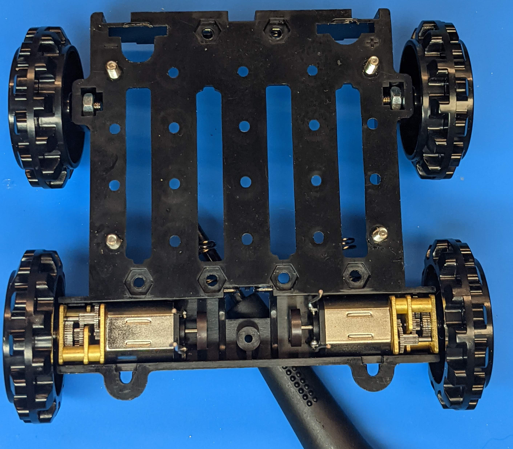
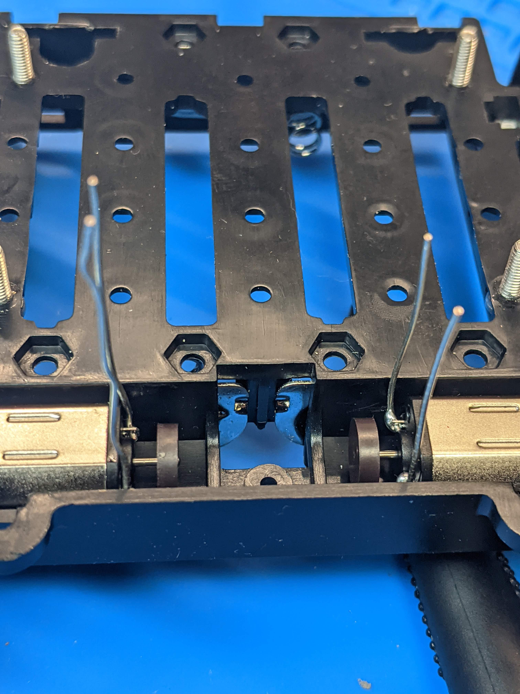
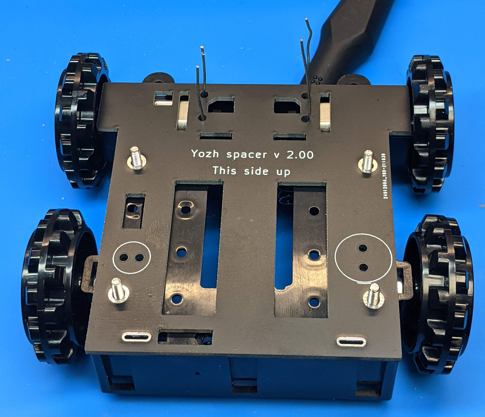
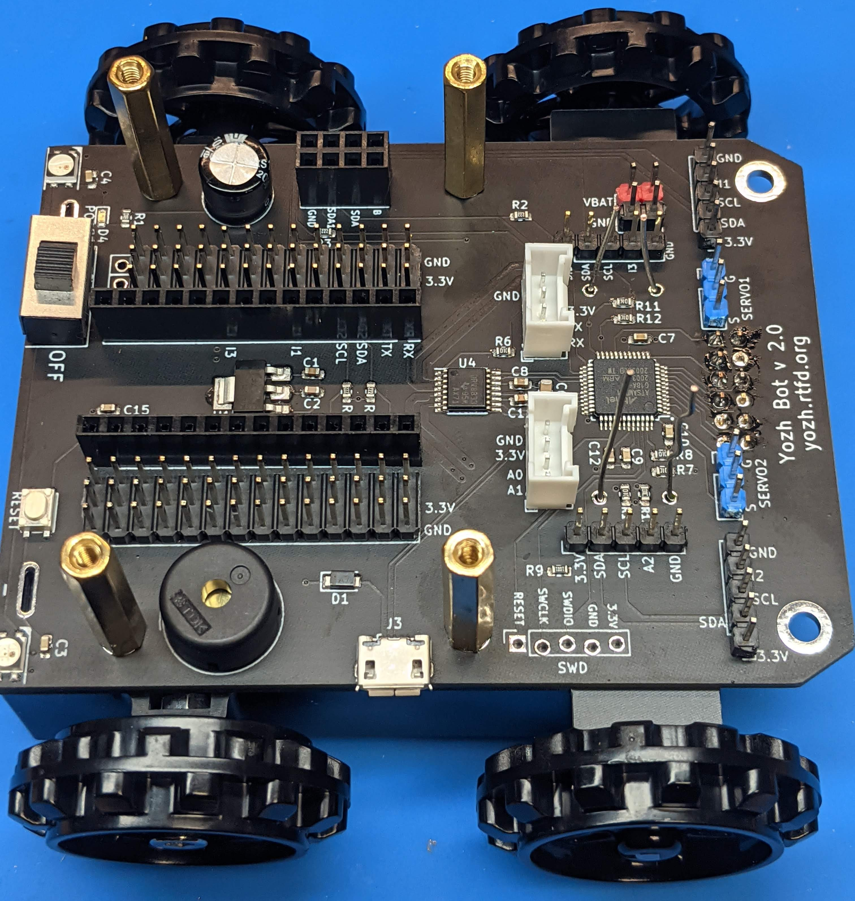

Assembling the chassis
======================
Take the Zumo chassis kit and open it. Make sure you have all components
as listed in `Zumo chassis user guide <https://www.pololu.com/docs/0J54/1>`__.
Discard the acrylic plate - we wont' be using it.

Now follow these steps:

1. Turn the chassis upside down. Remove the cover  from the battery
   compartment of the chassis and insert the double battery contacts in the
   slots as shown in the photo below, paying attention to orientation.
   Leave two single contacts for later.

2. Insert 4 M2.5 screws from Yozh kit in the
   holes as shown in the photo below. It should be a tight fit -- use a screwdriver
   to drive the screws all the way in.

3. Turn the chassis right side up. Attach the idler sprockets following the
   directions of `Zumo user guide <https://www.pololu.com/docs/0J54/3>`__.

4. Insert the motors with leads in the channel at the front of the chassis, aligning the
   gearbox with the grooves in the channel. The front plate of the gearbox
   should be even with the edge of the chassis. The motor leads you had soldered previously
   should be facing up.

   (Tip: place a pencil under the center of the chassis)

5. Take the spacer PCB and place it on the chassis, carefully threading the
   motor leads through the holes in PCB. The screws you had inserted should match
   the holes in the spacer PCB.
   **Warning**: spacer PCB is not symmetric - pay attention to **This side up**
   marking.

6. Repeat the same with the main board. Make sure that this board lies flat
   against the spacer board, with no gaps anywhere.

7. Tightly screw the 22mm M2.5 standoffs from the Yozh kit onto the screws
   protruding through the main board.

8. Put the silicone tracks on wheels (requires a little effort).
