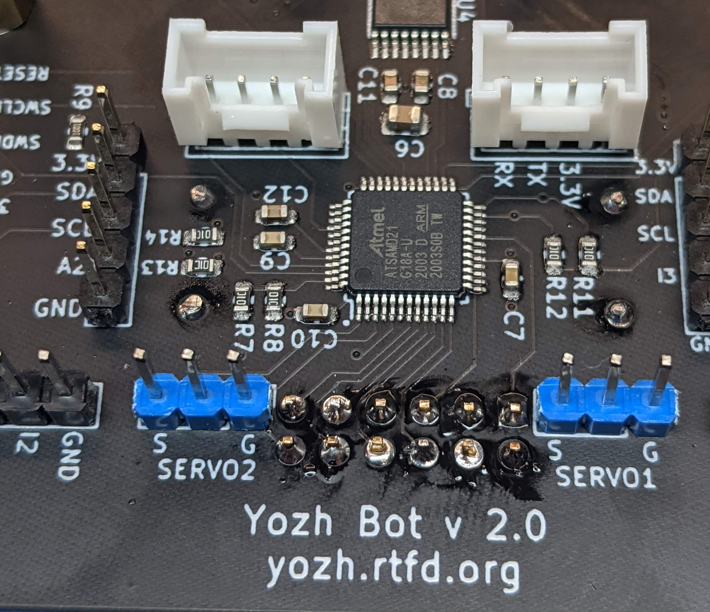
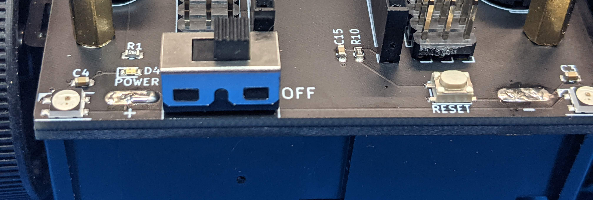

Soldering the chassis
=====================

Before continuing, make sure that power switch on the main board is in **OFF**
position.

Using the soldering iron, solder the motor leads protruding through the main
board to the board. Be careful with nearby  connectors - try to avoid touching
them with your iron. Use flush  cutters to trim remaining length of motor leads.

Now, turn the chassis over and insert the  two individual battery contacts as shown in
`Zumo user guide  <https://www.pololu.com/docs/0J54/3>`__. The solder tabs of the
two individual contacts should go through the holes in battery compartment and
into the slots in the spacer board and the main board. Insert 4 AA batteries
(making sure they are in correct polarity) to hold the battery terminals in
place until you solder them and close the  battery compartment cover.   Turn the chassis
over again and inspect the battery terminals; the top of solder tab should be
level with the top of the main board. If necessary, adjust the battery terminals.

Solder the tabs of the battery contacts to the  main board. The easiest way to
do that is by using a larger iron tip, heating the plating of the slot in the
main board, and then filling it with solder.

Once the solder cools, turn the switch on. The LEDs on the robot should light up,
indicating that the robot is powered.

Turn the robot off again.
