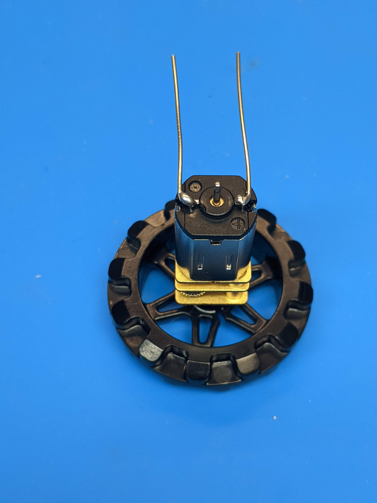

Preparing motors
================

Prepare  four pieces of solid core 22AWG wire. Each piece needs to be about
5cm long, about half of which should be stripped. (It is easiest to first strip
2.5cm from a roll of wire and then cut.) Use pliers
to form a short (about 3mm) 90 degree bend at **one** end of each of these pieces
of wire, as shown in the photo below.

Now, take the motors. Attach the sprocket to each motor, paying attention to
orientation: the side of the sprocket with the "lip" should be facing outwards.

Place the motors on the table, using sprockets as supports, and solder the motor
leads to each motor. (You probably want to use a third hand or similar device
to support the wires while soldering. )

**Important**: pay attention to proper orientation of the motors! One of motor
terminals is marked +; make sure that this terminal is on the right side as
shown in the photos.

After soldering the leads, cut off the unstripped part of each motor lead - it was
only needed to make it easier to hold the wire while soldering.

Finally, put the magnetic encoder disks on the rear shafts of the motors.
