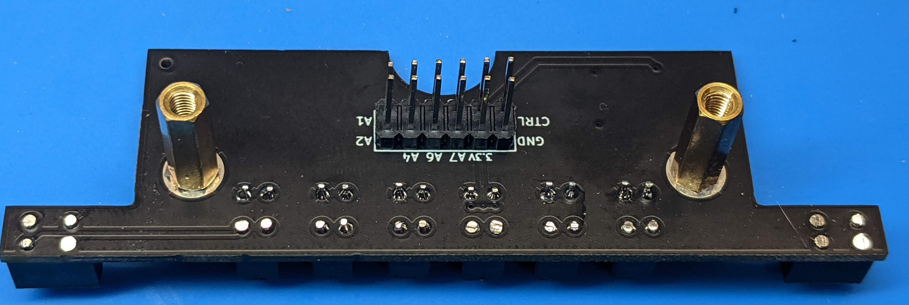
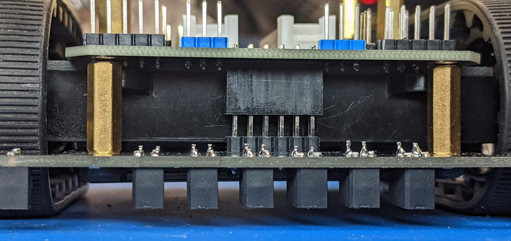
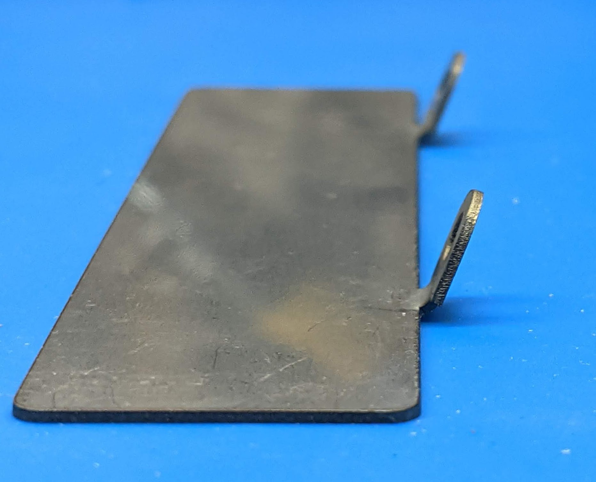

Reflectance array and the blade
===============================
Next step is attaching the reflectance sensor array to the front of the robot.

1. Get the reflectance sensor array and inspect the pins of the soldered header.
   If they are bent, try to gently straighten them.

2. Use M3 screws to attach the two 14mm M3 standoffs to the reflectance sensor
   array as shown in the photo.

3. Plug the reflectance array into the female header at the bottom of the robot
   main board. Pull it slightly out so that there is a small gap (about 1mm)
   between the top of the standoff and the bottom of the main board.

4. Get the blade. Using pliers, bend the two tabs to about 70 degree angle.

5. Insert the blade so that the tabs fit in the gap between the main board and
   the standoffs. If you bent it to the correct angle, the front of the array
   will be touching the blade. If necessary, remove the blade and use pliers again
   to adjust the angle.

6. Insert the short M-F M3 standoffs in the holes at the top of main board, through
   the hole in the blade tabs and into the long M3 standoff. Tighten by hand.
