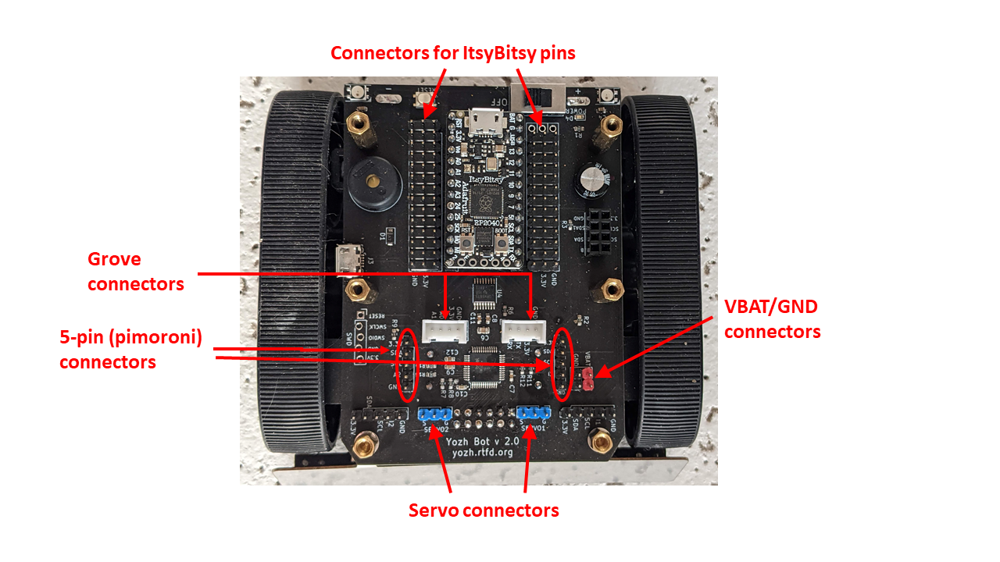

Connecting additional sensors
=============================
Yozh uses some of the ItsyBitsy pins for controlling built-in electronics as
shown in the table below. All other pins are available for connecting additional
sensors or other electronics.

+--------------+--------------------------------------+
| Pin          | Function                             |
+==============+======================================+
| SDA          | Used by I2C bus.                     |
+--------------+                                      |
| SCL          |                                      |
+--------------+--------------------------------------+
| 5            |         Buzzer                       |
+--------------+--------------------------------------+
| 7            | Used by front distance sensors board |
+--------------+--------------------------------------+
| 12           | Button B                             |
+--------------+--------------------------------------+
| 13           | Button A                             |
+--------------+--------------------------------------+
| 25           | Used by front distance sensors board |
+--------------+--------------------------------------+

I2C bus
-------
Pins SDA and SCL of ItsyBitsy are used for I2C communication with the following
components of the robot:

* Secondary MCU (I2C address: ``0x11``)

* OLED display (I2c address: ``0x3c``)

* Front distance sensors (I2C addresses ``0x29``, ``0x30``)

You can connect additional devices to the same bus as long as they have addresses
different from those listed above.

The bus operates at 3.3v; the main board contains pull-up resistors (2.2K) for
the I2C bus, so additional pull-ups are not necessary.

To connect new devices, you can use either the 5-pin connectors at the front
of the robot or Qwiic/Stemma QT connectors at the bottom of the top plate.

Connectors
----------

Yozh provides a number of connectors for connecting additional electronics to
ItsyBitsy:

* On each side of the ItsyBitsy there are three rows of **male headers** (you need
  to remove the top plate to access these headers). The outer row is ground,
  the middle row is 3.3V, and each pin in the row closest to ItsyBitsy is
  connected to the corresponding pin of ItsyBitsy (except the VBUS pin of
  ItsyBitsy which is not connected). This allows you to connect to any pin of
  ItsyBitsy - including those used for other components.

* In the front of the robot, there are two 5-pin male connectors. They follow
  the pinout convention of `Pimoroni breakout garden <https://shop.pimoroni.com/collections/breakout-garden>`__:

  - pin 1: 3.3v

  - pin 2: SDA

  - pin 3: SCL

  - pin 4: additional GPIO pin

  - pin 5: GND

  Pin 4 of the left 5-pin header (labeled I3) is connected to ItsyBitsy pin 8;
  pin 4 of  the right header is connected to A2.

* In front of the robot, there are also 4-pin Grove connectors. These 2mm pitch locking
  connectors, designed by Seeed Studio, are commonly used in hobby robotics;
  a wide variety of sensors and other components using this system are available, see
  https://wiki.seeedstudio.com/Grove_System/. The pinouts of these connectors are as follows:

  - Left Grove connector: pin 1 - RX, pin 2 - TX, pin 3 - 3.3v, pin 4 - GND

  - Right Grove connector: pin 1 - A0, pin 2 - A1, pin 3 - 3.3v, pin 4 - GND

* On the left side of the robot, there are additional male headers for power
  connections, connected to GND and battery (VBAT). Depending on the batteries
  used and their charge level, voltage of VBAT pins can range from 4.5 - 6.5 V.

* Finally, at the bottom of the top plate, there are two Qwiic/Stemma QT I2C
  connectors.
