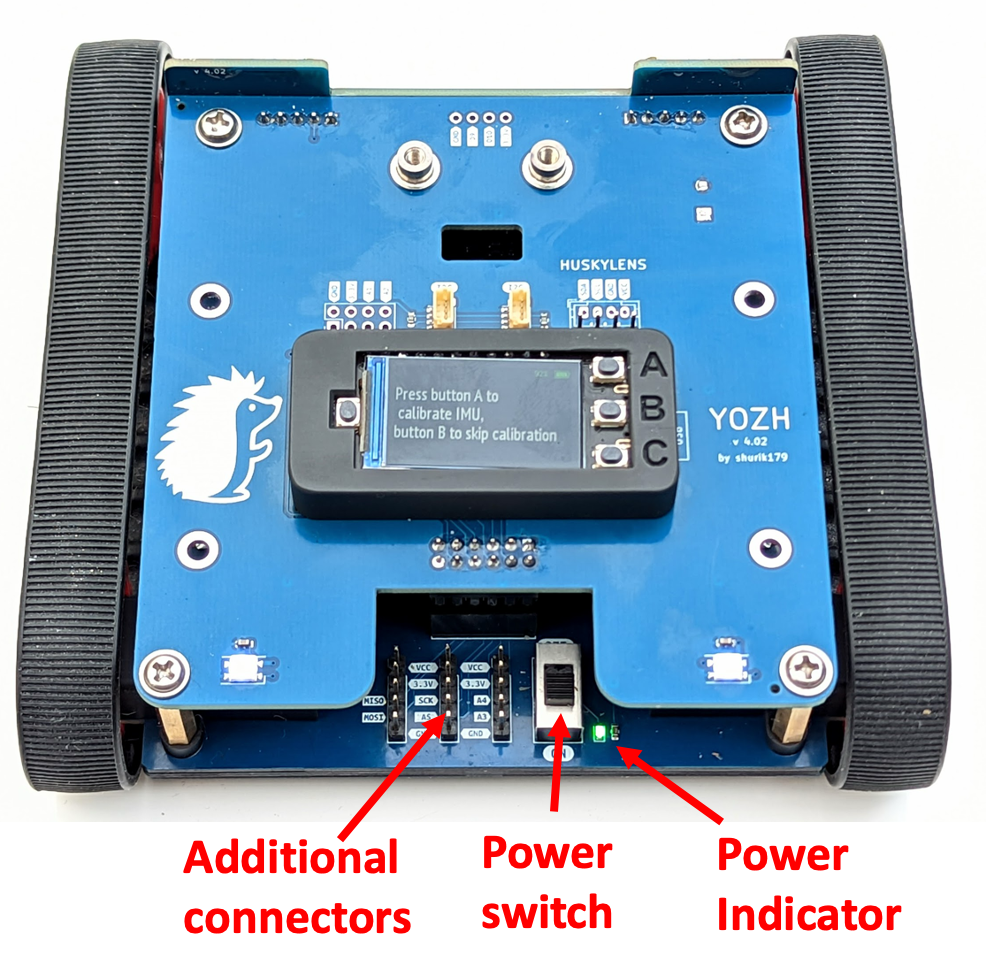

Connecting additional devices 
=============================
Youzh provides connectors for additional sensors and other eelctroncis, as described below. 

Top plate
---------

The top plate contains the following connectors:

* two Qwiic/StemmaQT connectors, for connecting I2C sensors. These connectors use the 
  default I2C pins of ESP32-S3 board. The same I2C bus is also used for connecting to 
  secondary MCU (I2C address 0x11) and distance sensors (I2C addresses 0x29, 0x30); 
  thus, make sure that the devices you connect have I2C addresses different from those 
  listed above. Pull-up resistors (3.3K) on SCL and SDA lines are already provided, 
  so there is no need to add your own. 

* 8-pin connector (unpopulated), containing pins for 3.3v, GND, and pins A1, A2, TX, RX
  of ESP32-S3 

* Huskylens connector. This is also gives access to the same  I2C bus; however, instead of 3.3V, 
  it provides VCC, which is directly connected to the battery (thus, voltage ranges from 4.2-3.5V 
  depending on battery charge.) In addition, the pin order is different from the one used by Qwiic. 
  This connector provides both standard male pin headers and JST PH 4-pin connector, which share 
  the same pins. This connector is primarily intended for connecting Huskylens AI camewra by DFrobot, 
  but coudl also be utilized by other devices as long as they are capable of using the battery voltage. 

  Note that the SDA and SCL lines are pulled up to 3.3v, not to VCC. 

.. figure:: ../images/top-annotated.jpg
   :alt: Top view of the robot 
   :width: 80%

Main board connectors
---------------------

In the rear of the main robot board, there are even more connectors, providing access to SPI 
(MISO/MOSI/SCK) pns of ESP32-S3 and pins A3, A4, A5 (you can use one of them as chip select 
line for SPI). 

Note that  the SPI bus is also used for communication with the display. 

