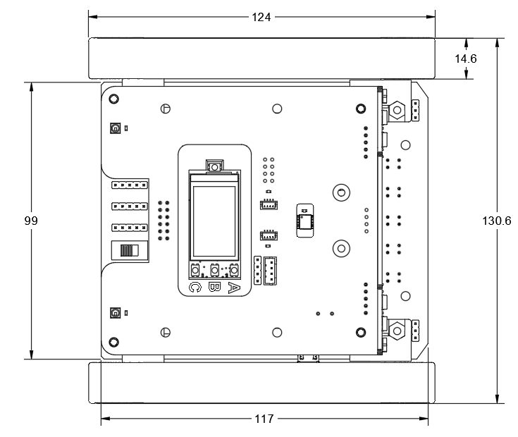
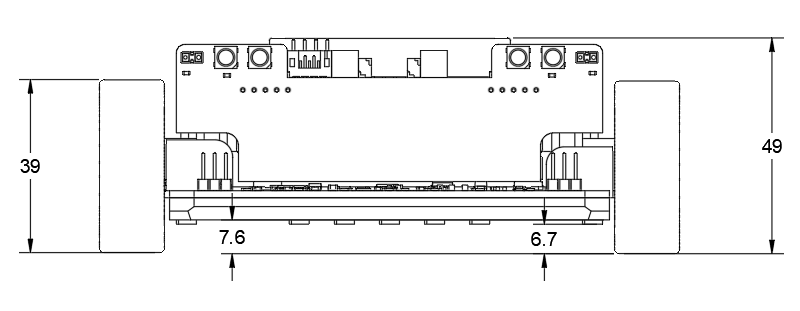

Dimensions  and 3d model
========================

Yozh dimensions are 12.4 cm (Length) * 13 cm (width) * 4.9 cm (height).
Ground clearance is about 7 mm; however, since all sensors and everything else
is inside the tracks profile (looking from the side), the robot is capable of
going over (long) obstacles up to about 1.5 cm.

You can view the 3d model, created in Fusion360, at https://a360.co/40igAyW

.. figure:: ../images/Full_robot_4.02.png
   :alt: Full robot 3d model
   :width: 80%

