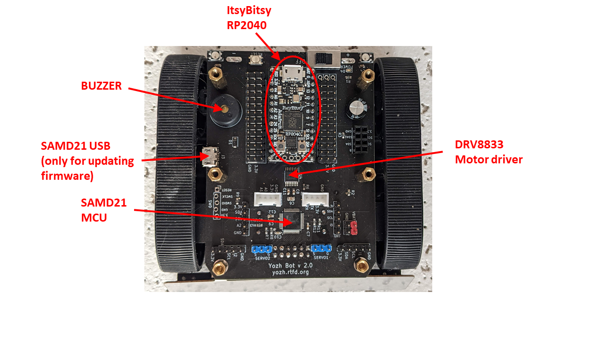

Electronics
===========
The robot is controlled by two microcontrollers (MCU):

* Main (master) MCU: `ESP32-S3 Reverse TFT Feather  <https://www.adafruit.com/product/5691>`__
  This MCU is programmed by the user in CircuitPython. Provided CircuitPython
  library, documented in :ref:`Yozh Library Guide <library>`, provides convenient
  functions for using all features of the robot.

* Secondary (slave) MCU: SAMD21G18A. This MCU is responsible for all low-level
  operations, converting high-level commands coming from main MCU into signals
  sent to motors, servos and more, thus freeing pins and other
  resources of the main MCU for other purposes.  Secondary MCU  is also responsible for counting
  the encoder pulses and running the PID control loop maintaining motor speed.
  This MCU comes preloaded with firmware, written in C++ (using Arduino IDE).
  Normally, the user shouldn't need to touch this firmware.

The two MCUs talk to each other  using I2C communication protocol; main MCU acts as
the master on the I2C bus, and the secondary acts as slave.

Some of Yozh hardware is directly controlled by the main MCU, without going
through the secondary one:

* TFT  display

* Buttons

* Buzzer

* Distance sensors

* Two indicator NeoPixel leds

* battery voltage monitor

Everything else -- motors, encoders, servos, reflectance sensor
array,  Inertial Motion Unit -- is handled by the
secondary MCU.
