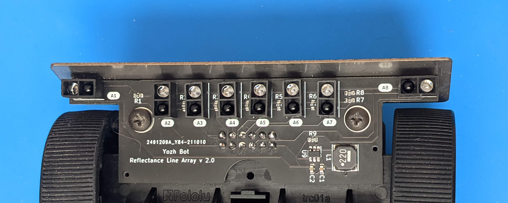
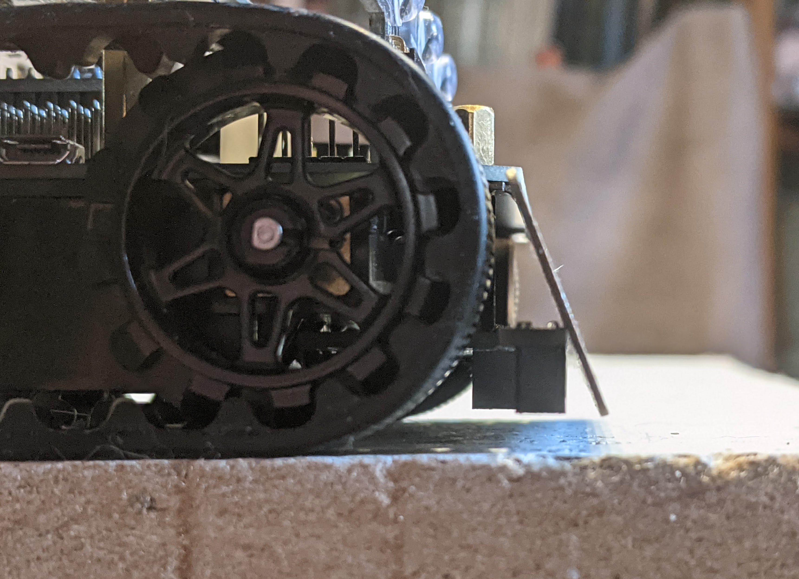

Sensors
=======

Yozh robot has several built-in sensors.

Reflectance array
-----------------
In the front of the robot, there is an array of 8 down-facing reflectance
sensors for detecting field borders, following the line, and other similar tasks.
It uses `ITR9909 <https://lcsc.com/product-detail/Reflective-Optical-Interrupters_Everlight-Elec-ITR9909_C53399.html>`__ sensors
by Everlight. The sensors are labeled A1 through A8.

Distance sensors
----------------

Yozh also contains a removable board with two front-facing `VL53L0X
<https://www.st.com/en/imaging-and-photonics-solutions/vl53l0x.html>`__
Time-of-Flight laser distance sensors by ST Microelectronics. These sensors
have maximal distance of 2m; reliable sensing distance is closer to 1.5m.
Each sensor has 25 degrees; this leaves a very small "blind spot" immediately
in front of the robot, but provides complete coverage enabling the robot to
detect any  obstacle placed between 15-150 cm away.

These sensors  can be used for obstacle avoidance, object tracking,
or other similar purposes.
