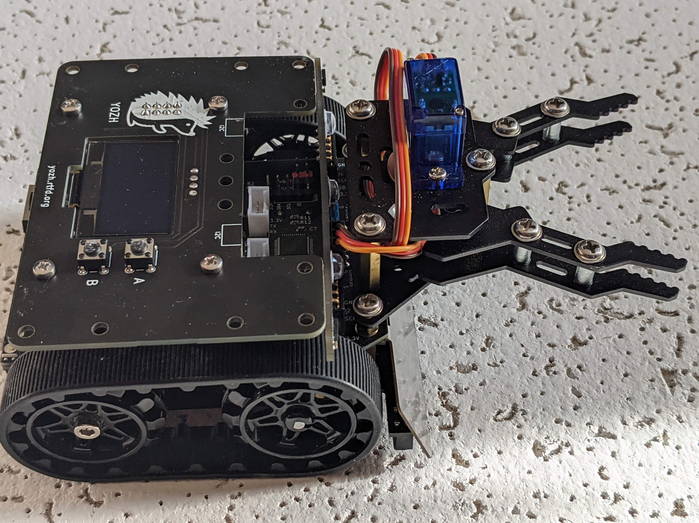

Servos and attachments
======================
Yozh contains two ports for connecting servos, as shown in the photo below.
These ports use  standard pin order: GND, VCC, SIGNAL. To help you identify the
pins, there are small letters S (Signal) and G (GND) next to corresponding pins.
VCC is directly connected to the battery, so voltage ranges between 4.5-6.5V
depending on battery charge.

Yozh can also be used  with mechanical attachments (`grabber <https://www.dfrobot.com/product-2128.html>`__,
`forklift <https://www.dfrobot.com/product-2129.html>`__,...) by DFRobot --
see photo below for Yozh with the grabber (beetle) attachment. US customers
might find it easier to order DFrobot kits from DigiKey:

  * `Grabber <https://www.digikey.com/en/products/detail/dfrobot/ROB0156-B/13545231>`__

  * `Forklift <https://www.digikey.com/en/products/detail/dfrobot/ROB0156-F/13545230>`__

  * `Loader <https://www.digikey.com/en/products/detail/dfrobot/ROB0156-L/12324924>`__

Note that some of these attachments might interfere with the distance sensors.

