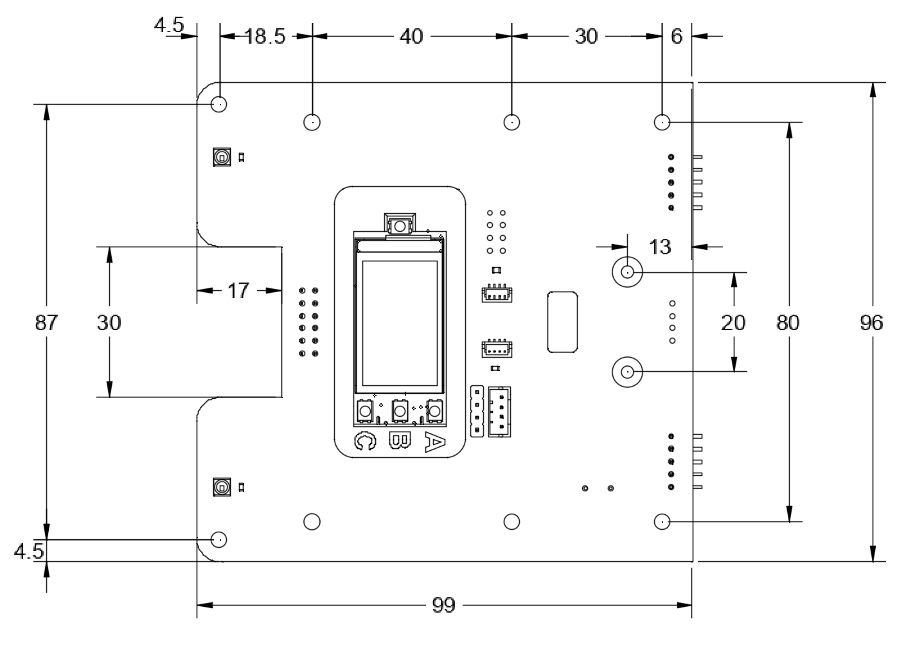

Top plate
=========
On the top of Yozh robot, there is a top plate containing the following
elements:

* The main MCU (`ESP32-S3 Feather  <https://www.adafruit.com/product/5691>`__ ), with 
  240x135 color TFT display, reset button, and  
  three  buttons (labeled A, B, C) for user interaction 

* two Qwiic/Stemma QT I2C connectors 

* several  connectors for connecting additional electronics (see FIXME for details)

* a number of 3mm mounting holes for attaching additional electronics

The top plate is mounted on the robot using 20mm long M3 standoffs. If
necessary, it can be removed to access the robot interior. 

The diagram below shows dimensions and hole locations.

