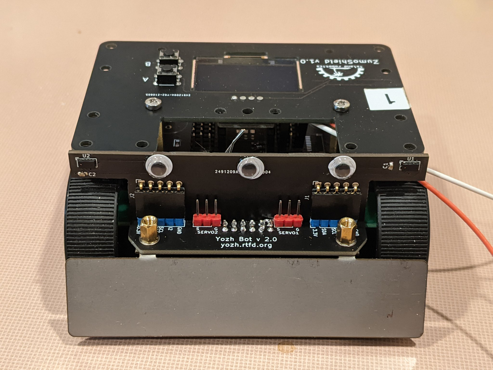

===========================
Yozh Robot
===========================

Yozh is a small (under 10cm*10cm) robot, based on Pololu's Zumo chassis. It was
created by Alexander Kirillov for a robotics class at SigmaCamp. Below are the
key features of this robot.

The robot consists of the following components:

* `Zumo chassis <https://www.pololu.com/product/1418>`__ by Pololu

* Power source: 4 AA batteries (NiMH rechargeable batteries recommended)

* Two micro metal gearmotors by Pololu (`6V, HP, 75 gear ratio <https://www.pololu.com/product/2215>`__),
  with motor encoders

* Custom electronics board, containing a slave MCU (SAMD21) preprogrammed with firmware,
  which takes care of all low-level operations such as counting encoder pulses,
  controlling the motors using closed-loop PID algorithm to maintain constant
  speed, and more

* `ItsyBitsy RP2040 <https://www.adafruit.com/product/4888>`__ by Adafruit,
  which serves as robot brain. It plugs into the main board and is programmed by
  the user in CircuitPython, using a provided CircuitPython library to
  communicate with the slave MCU over I2C. This library provides high-level
  commands such as *move forward by 30cm*

* Included sensors and electronics:

  * Top plate with 128*64 **OLED display** and 2 **buttons** for user interaction
  * Bottom-facing **reflectance array** with 8 sensors, for line-following and other similar tasks
  * Two front-facing **distance sensors**, using VL53L0X laser time-of-flight sensors,
    for obstacle avoidance
  * A 9DOF **Inertial Motion Unit** (IMU), which can be used for determining robot
    orientation in space for precise navigation
  * Two RGB **LEDs** for light indication and a **buzzer** for sound signals
  * Two ports for connecting **servos**
* There are plenty of pins available for connection additional electronics. We
  also provide several standard connectors for users convenience
  (Qwiic/Stemma QT connector for I2C devices, Grove connectors)
* Yozh is compatible with mechanical attachments (`grabber <https://www.dfrobot.com/product-2128.html>`__,
  `forklift <https://www.dfrobot.com/product-2129.html>`__,...) by DFRobot.

All robot design is open source, available in |github| under MIT  License, free
for use by anyone. We also plan to create a Yozh kit which would be sold on
Tindie for those who want to build the robot but do not have time or skill
to assemble their own PCBs.

.. toctree::
    :caption: Table of Contents
    :maxdepth: 2

    assembly
    userguide
    details
