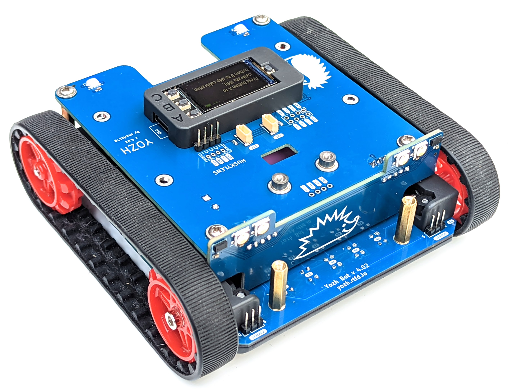

##########
Yozh Robot
##########

Yozh is a small (about 13cm*13cm) robot, inspired by  Pololu's Zumo robot. It was
created by `shurik179 <https://github.com/shurik179>`__ for a robotics class at
`SigmaCamp <http://sigmacamp.org>`__. Below are the
key features of this robot.

* **Dimensions:** Length: 12.4 cm; width: 13 cm; height: 4.8 cm

* **Power:** one or two 18650 Li-Ion batteries

* **Wheels and motors:** uses `silicone tracks <https://www.pololu.com/product/3034>`__  and
  `6V, HP, 75 gear ratio <https://www.pololu.com/product/2215>`__ micro metal
  gearmotors, both by Pololu.

* **Main controller:** `ESP32-S3 Feather board  <https://www.adafruit.com/product/5691>`__ by Adafruit,
  which serves as robot brain. It  is programmed by  the user in CircuitPython, using a provided
  CircuitPython library. This library provides high-level
  commands such as *move forward by 30cm*

* **Electronics:** a custom electronics board, containing a secondary MCU (SAMD21) preprogrammed
  with firmware,  which takes care of all low-level operations such as counting encoder pulses,
  controlling the motors using closed-loop PID algorithm to maintain constant
  speed, and more.

* Included sensors and other electronics

    * 240*135 **color TFT  display** and 3 **buttons** for user interaction

    * Bottom-facing **reflectance array** with 7 sensors, for line-following and other similar tasks

    * Two front-facing **distance sensors**, using VL53L0X laser time-of-flight sensors,
      for obstacle avoidance

    * A 6 DOF **Inertial Motion Unit** (IMU), which can be used for determining robot
      orientation in space for precise navigation

    * Two RGB **LEDs** for light indication and a **buzzer** for sound signals

    * Four RGBW LEDs used as headlights 

* Expansion ports and connections:

    * Two ports for connecting **servos**

    * Two  I2C ports, using Qwiic/Stemma QT connector

    * Several available pin headers for connecting other electronics

    * Yozh is compatible with mechanical attachments
      (`grabber <https://www.dfrobot.com/product-2128.html>`__, `forklift <https://www.dfrobot.com/product-2129.html>`__,...) by DFRobot.

All robot design is open source, available in |github| under MIT  License, free
for use by anyone. We also plan to create a Yozh kit which would be sold on
Tindie for those who want to build the robot but do not have time or skill
to assemble their own PCBs.

You can view photos and videos of Yozh here:

https://photos.app.goo.gl/grQfWu86DGW8zRTT8

.. toctree::
    :caption: Table of Contents
    :maxdepth: 1

    quickstart
    details
    library
