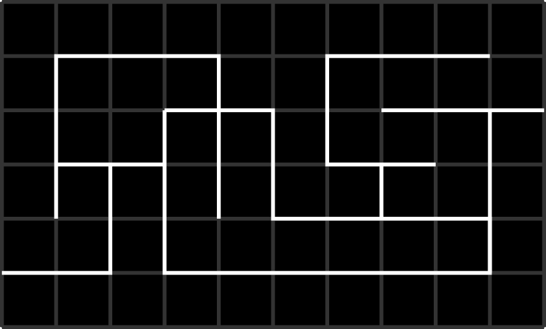

Maze runner: wall following
============================
In this challenge, we will teach the robot find its way out of a maze.
The maze is made of approx. 3x5 ft sheet of plywood, painted black.
White masking tape (3/4 inch  wide) is used to mark passages
forming the maze; these lines follow rectangular grid with
0.5 ft squares.

Finding a way out of a maze is a classic problem, and there is a number of algorithms
for doing that. The simplest of them is the wall following rule.

Start following passages, and whenever you reach a junction always follow the
leftmost open passage. This is  equivalent to a human walking in the  a maze by
putting his  hand on the left wall and keeping it on the wall as he walks through.

This method  is guaranteed to find an exit if we start at the entrance
to the maze; then  this method allows us to explore a section
of the maze and find our way out. However, it  is not guaranteed to
find an exit if we start in the middle of the maze: the robot could be
going in circles around an "island" inside the maze.

The first draft of the program looks as follows (not including initialization
and setup):

.. code-block:: python

    while True:
        go_to_intersection()
        check_intersection()
        if there is a passage to the left, turn left
        otherwise, if there is a passage forward, go forward
        otherwise, turn right

Function `go_to_intersection()` should follow the line until we reach an
intersection (that is, until the reflectance sensors at the front of the robot
are above an intersection). This function is very similar to line follower algorithm
from the previous project, with added checks: it should stop when reflectance
sensor A1 (rightmost) or A8 (leftmost) sees white.

Function `check_intersection()` should do three things:

1. Slowly advance forward until  the center (not front!)  of the robot is
   above the intersection.

2. While doing this, keep checking  whether there is a passage to the left
   and record it somehow; same for passage to the right

3. once we advanced  so that the center of the robot is above the intersection,
   also check if there is a passage forward.

We can achieve this by asking the robot to start moving  forward until
we have travelled 5 cm;  while doing this, we will be checking the
line sensors. If the leftmost line sensor (number 6)  sees white, it means that
there is a passage to the left. To record it, we can create boolean variable
`path_left` and set it to `True` once the sensor 6 sees white
(Also, we should remember to set it   to `False` initially):

.. code-block:: python

   def check_intersection():
       # go forward while checking for intersection lines
       bot.reset_encoders()
       path_left = False

       bot.set_motors(30,30) #start moving forward slowly
       while bot.get_distance()<5:
           if bot.sensor_on_white(bot.A8):
               path_left = True
       bot.stop_motors()

We should also add similar code for determining whether there is a path to
the right (left to the reader as an exercise).

Next, once we advanced, we need to check if there is a passage ahead.
This is easy using `all_on_black()` function (if there is no passage forward,
all sensors will be on black).

Finally, we need somehow to return this information to whatever place in our
program called this function. If we needed to return one value, we could just
say `return(path_left)`, but here we need to return 3 boolean values:
`path_left`, `path_forward`, `path_right`. One way to do that is to put them in  a list and
return the list. This gives the following code:

.. code-block:: python

   def check_intersection():
       # go forward while checking for intersection lines
       bot.reset_encoders()
       path_left = False
       path_forward = False
       path_right  = False

       bot.set_motors(30,30) #start moving forward slowly
       while bot.get_distance()<5:
           if bot.sensor_on_white(bot.A8):
               path_left = True
           ....
       bot.stop_motors()
       if not bot.all_on_black():
           path.forward = True
       # now, let us return the found values
       return([path_left, path_forward, path_right])

Now we can write the main program:

.. code-block:: python

   while True:
       go_to_intersection()
       paths = check_intersection()
       if paths[0]:
          # path to the left is open
          bot.turn(-90)
      elif paths[1]:
          # path forward is open - do nothing, no need to turn
          pass
      elif paths[2]:
          bot.turn(90)
