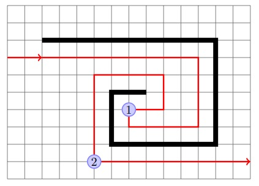

Maze runner: pledge algorithm
============================
This is a modified version of wall following that's able to jump between islands, to solve mazes that wall following cannot.
It's a guaranteed way to reach an exit on the outer edge of any 2D maze from any point in the middle.
However, it is not guaranteed to visit every passage inside the maze, so this algorithm will not help you if you are
looking for a hidden treasure inside the maze.

Start by picking a direction, and always move in that direction when possible. When you hit a wall, start wall following,
using the left hand rule. When wall following, count the number of turns you make, a left turn is -1 and a right turn is 1.
Continue wall following until your chosen direction is available again and the total number of turns you've made is 0; then
stop following the wall and go in the chosen direction until you hit a wall. Repeat until you find an exit.

Note: if your chosen direction is available but the total number of turns is not zero (i.e. if you’ve
turned around 360 degrees or more), keep wall following until you untwist yourself. Note that Pledge
algorithm may make you visit a passage or the start more than once, although subsequent times will
always be with different turn totals.

In the figure above, thick black lines show the walls of the maze; the red line shows the path of the robot. At point
1, the robot turns so that it is again heading the same direction as in the beginning; however, the
number of turns at this point is not zero, so the robot continues following the wall. At point 2, the
robot is again heading in the original direction, and the number of turns is zero, so it stops following
the wall. Had the robot left the wall at point 1, it would be running in circles.

To program the Pledge algorithm, we need to keep track of robot direction and number of turns. In
fact, just the number of turns is sufficient: if we know the number of turns, we can determine
the direction. Thus, we introduce a global variable ``numTurns``. Every time we turn 90 degrees clockwise,
``numTurns`` is increased by 1; every time we turn 90 degrees counterclockwise, we decrease ``numTurns``
by 1.

Thus, the draft of the program would be

.. code-block:: python
		
	numTurns = 0
	def loop():
	    goToWall()
	    followWall()

where
	    
* Function ``gotoWall()`` goes forward along the line, through intersections, until the robot hits a wall

* Function ``followWall()`` follows the wall using left hand rule until we are again facing the same direction as before, with numTurns=0.

For each of these functions, we need to describe carefully what conditions the function expects at the start and in what condition it leaves the robot at the end (which way is it facing? is it at intersection?).

goToWall():
	* Initial condition: robot is on the line (i.e., the line is under the center of the front sensor array; robot could be at intersection), ``numTurns=0``
	* Final state: robot is at an intersection, there is a wall ahead (i.e., no passage forward), and ``numTurns=0``

followWall():
	* Initial condition: robot is at an intersection, there is a wall ahead (i.e., no passage forward), and ``numTurns=0``
	* Final state: robot is on the line (i.e., the line is under the sensor of the front sensor array; robot could be at intersection), ``numTurns=0``

When we think about implementing the algorithm, we see that in the very beginning of ``followWall()``,
the robot needs to turn so that the wall is on its left. Normally it would be just a 90 degree right
turn; however, if we are at a dead end, we need to turn 180 degrees. Thus, we need to know
whether there is a passage to the right. Therefore, we add one more condition to the final state of ``goToWall()``:

* Final state: robot is at the intersection, there is a wall ahead (i.e., no passage forward), ``numTurns=0``, and global variable ``passageRight`` contains information about whether there is a passage to the right.

To implement these two functions, we will make use of the functions ``goToIntersection()``,
``checkIntersection()`` which we used for the wall-following algorithm. 
Implementing ``goToWall()`` is trivial.

For followWall(), in the beginning we must put

.. code-block:: python

	if passageRight:
	    turn(90)
	    numTurns += 1
	else:
	    # no passage to the right - need to turn 180
	    turn(180) 
            numTurns += 2

After this, we do the regular line following algorithm: go to intersection, check intersection, turn
as needed, except that we should exit the function if, after a “turn as needed”, we have ``numTurns=0``.
We leave it to you to complete the algorithm.
