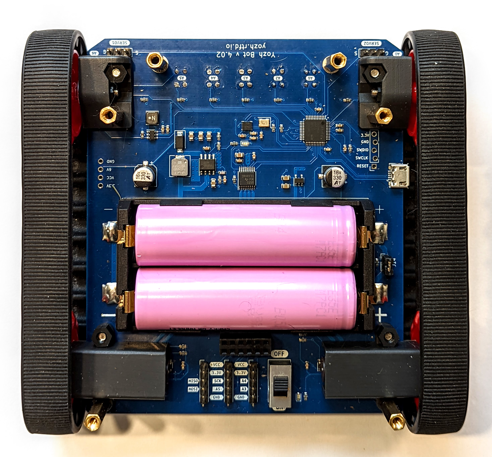

Installing the batteries
========================

Yozh is powered by one or two 18650 Li-Ion batteries, inserted in the
battery compartment inside the robot; to access it, you need to remove
the top plate.  

**Warning**: Li-Ion batteries can be dangerous if not handled right! please
make sure to place them with  correct polarity. 
Always **turn the power switch off** before
removing the top plate, replacing the battery,  
or doing any other work on the robot.

For most purposes, it suffices to use one battery; 
place it in the slot closest to the back of the robot 
(of course, power switch should be off while you are doing it). Make sure 
to observe correct polarity as labeled on the PCB!

See section ``Power`` in ``Yozh Features in detail`` document for suggestiosn on 
choosing the best 18650 battery or proper method of installation if you want to 
use two batteries -- there are some precautions to be observed!
