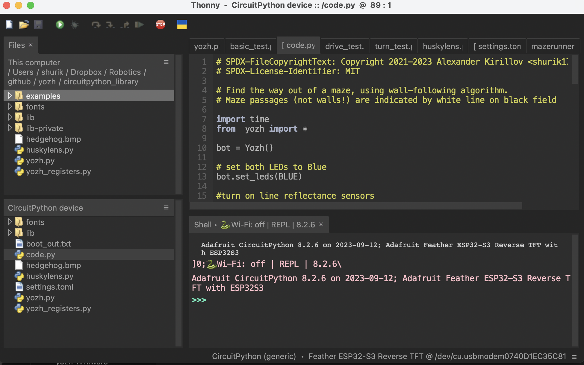

Thonny editor
=============

We suggest using `Thonny editor <https://thonny.org/>`__ for creating and editing
programs for your robot. Experienced programmers can use their favorite text editor instead - but
please check `this page <https://learn.adafruit.com/welcome-to-circuitpython/recommended-editors>`__
for some common problems and list of recommended editors.

To install Thonny,  visit `Thonny webpage <https://thonny.org/>`__, download the installer for 
your system and run it. 

After installation, you also need to configure Thonny to use the CircuitPython interpreter. 
Go to ``Run`` menu and select ``Configure Interpeter``. Select ``Circuit Python (Generic)``. 
While you are there, you can also adjust the theme and font to your liking -- for example, 
you can switch to dark theme, shown below. After making your choices, click ``OK`` to 
save the configuration. 

To verify the installation, connect your computer to the ESP32-S3 MCU of Yozh robot. 
Hit the red ``Stop`` button to reconnect to the board. Thonny should now show the files 
on the CURCUITPY drive,  as shown below:

